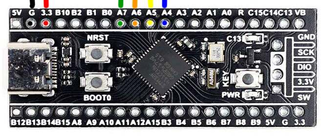

# STM32 Cortex M4 code examples

I've taken some Udemy online embedded software courses related to STM32 Cortex M microcontrollers. 
The courses were taught using Keil and OpenSystem Workbench IDEs, and I was implementing the code exercises using STM32CubeIDE.
So I thought this would make a good repository of STM32 M4 STM32CubeIDE code examples. I've also added non-course related code related to DMA, DSP etc.

## Credits

* [FreeRTOS](https://www.udemy.com/course/mastering-rtos-hands-on-with-freertos-arduino-and-stm32fx)
* [DMA](https://www.udemy.com/course/microcontroller-dma-programming-fundamentals-to-advanced)
* [Peripherals](https://www.udemy.com/course/microcontroller-programming-stm32-timers-pwm-can-bus-protocol)
* [ARM Assembler](https://www.udemy.com/course/arm-assembly-language-from-ground-uptm-2/)
* [Bootloader](https://www.udemy.com/course/stm32f4-arm-cortex-mx-custom-bootloader-development)
* [Udemy code repository](https://github.com/niekiran) : Note these were implemented for a Nucleo STM32F446 board.

## Development Environment

### Software

* Ubuntu 20.04 AMDx64
* STM32CubeIDE v1.2.0 / 1.6.0
* CubeMX MCU Firmware version FW_F4 V1.26.0
* FreeRTOS v202012.00
* SystemView 3.20

### Hardware

* JLink JTAG/SWD debugger
* STLink v2 clone with [mod for SWO trace](http://eeblog.co.uk/2018/11/29/swo-with-cubemx-using-st-link-clones/)
* PL2303 HXD USB-UART adapter - [max data rate 12Mbps](https://www.sjoerdlangkemper.nl/2019/03/20/usb-to-serial-uart/)
* WeAct v1.3 STM32F411CEU6 development board (FreeRTOS and Semi-hosting/SWO demo)

* DevEBox STM32F407VGT6 development board (All other projects)

## Project Notes

You will find relevant notes in the project sub-directories

