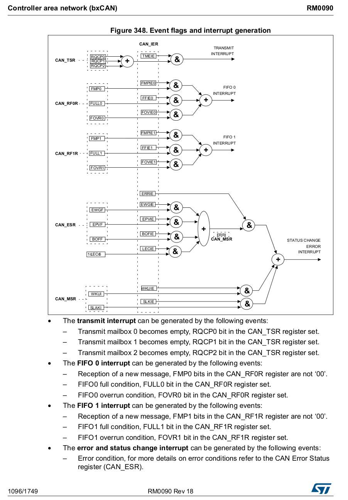
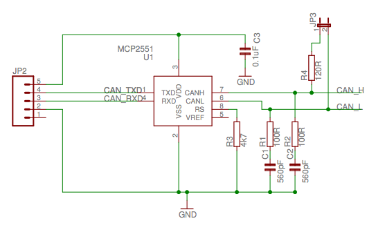

## Explore available bitrates and bit-timing configurations given the timing clock frequency

*  Use [this website](bittiming.can-wiki.info) to generate the configuration registers. 
 * 1 bit has Nq time quanta (depending on the prescaler), divided into 4 segments.
 * We have to allocate Nq across the 4 segments.
 * Higher Nq is better (16 recommended for CAN FD).
 * The yellow highlighted rows in the table are optimal configurations for error immunity.

## Acceptance filtering

* Use the spreadsheet stm32_can_filter_config.ods to generate the bit fields for acceptance filtering.

## CAN Interrupts

There are 4 IRQs allocated to CAN1 and CAN2 (8 total). This diagram shows the events that
can generate interrupts and which IRQs they are associated with.

## MCP2551 transceiver module schematic

I used the schematic below with R3 = 10K as that was the minimum value shown in the datasheet.

