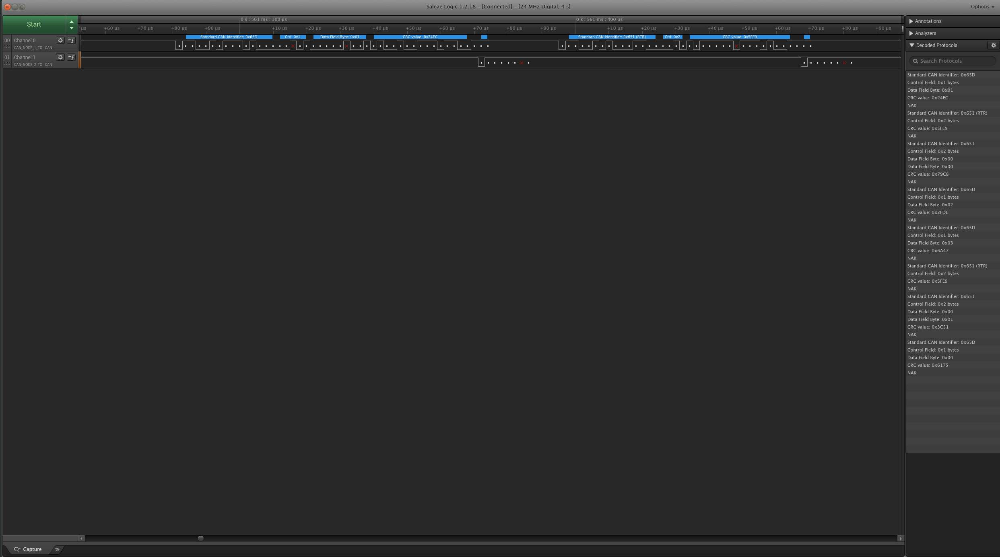

## Hardware setup

Two DevEBox STM32F407VGT6 dev boards connected to MCP2551 CAN bus transceivers on a prototyping board. 
The twisted-wire CAN 'bus' (black/white wires) is approximately 1m long. Bus bitrate is configured as 500kb/s. 
The JLink debugger provides 5V Power supply for both boards and transceivers. Both boards are flashed
with identical firmware. The MCP2551 transceivers operate at 5V, the STM32F407 CAN RX lines are 5V tolerant.

If you press button PA0
on a board, it starts transmitting as N1, and the other board responds as N2. External LEDs are connected to
the board designated as N2 in my setup.

A USB logic analyzer probes the CAN1_TX lines on both boards (PA12).
Channel 0 of the logic analyzer is connected to the Node 1 CAN1_TX pin. Channel 1 is connected to 
Node 2 CAN1_TX pin. A CAN bus protocol analyzer is added for both channels  with bus clock
set to 500000. 

4 seconds of data @24Msamples/sec was logged by the logic analyzer. You can see the decoded frame details on Node 1 and Node 2 TX lines on the right window pane.

## Zoomed-out view of Node 1 and Node 2 CAN_TX signals

In the zoomed out view, you can see Node 1 transmitting the "LED control" DATA frame with standard message
ID 0x65D and a single byte data payload encoding the LED number. This is followed by a remote/request RTR frame with standard message ID 0x651 requesting 2 bytes of data. Both frames are ACKed by Node N2.

After ~6.5milliseconds, Node 2 sends the response DATA frame for msg id 0x651 with
the two byte data payload (an incrementing counter for each response data frame). The response
data frame is ACKed by node N1. 

NOTE : The delay in response is because I had a debug uart print message before sending the response
frame. I have fixed the code now, so you should see the N2 response data frame immediately after the
N1 RTR frame.

## Detail view of Node 1 DATA frame and RTR frame transmissions, ACKs by Node 2

## Detail view of Node 2 response DATA frame, ACK by Node 1

