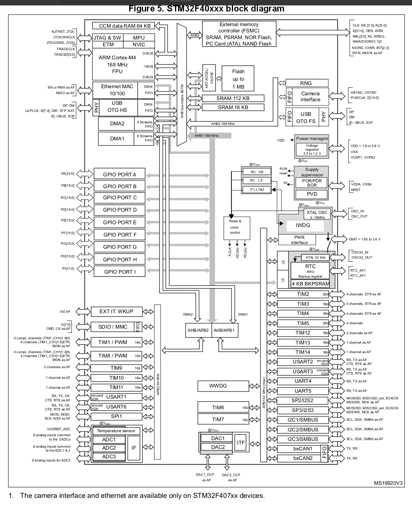
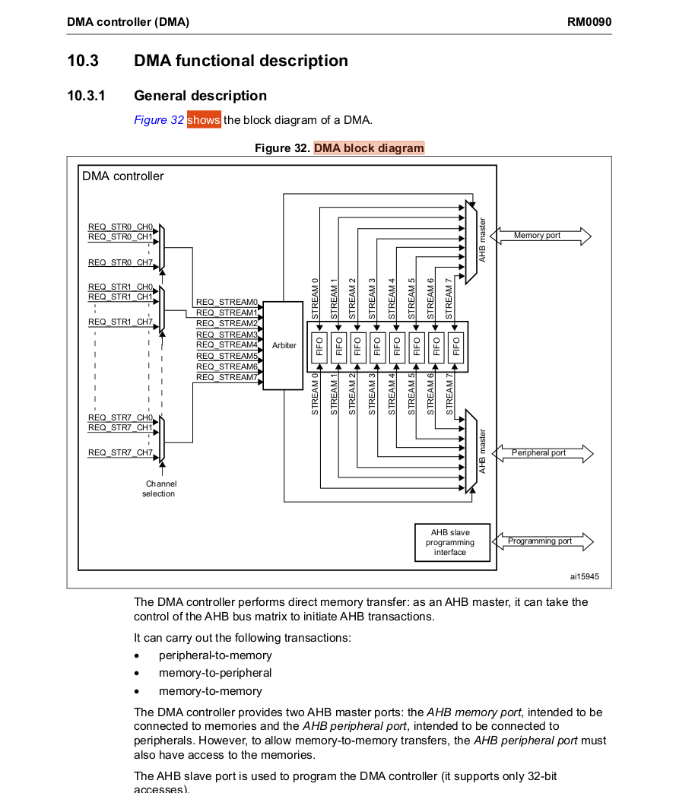

## STM32F407 Block Diagram
Check this diagram to see what buses the DMA controllers and peripherals are connected to.

## Bus matrix
Check this diagram to see what paths are possible between the DMA1 and DMA2 controllers, RAM and 
peripherals.

## DMA Block diagram
Overall view of request lines, streams and internal fifos.

