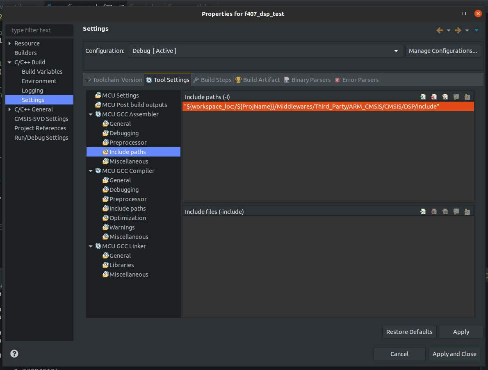

## Using CMSIS DSP in STM32CubeIDE v1.2.0

## Install CMSIS DSP package

* Open the CubeMX .ioc file within STM32CubeIDE
* Go to the Additional Software tab
* Select CMSIS in the Software Component Class
* In the Packs window select CMSIS CORE and CMSIS DSP (Library)

## Activate CMSIS DSP for project

## Specify Compiler include path for CMSIS DSP header files

## Specify Linker path and name for CMSIS DSP library

