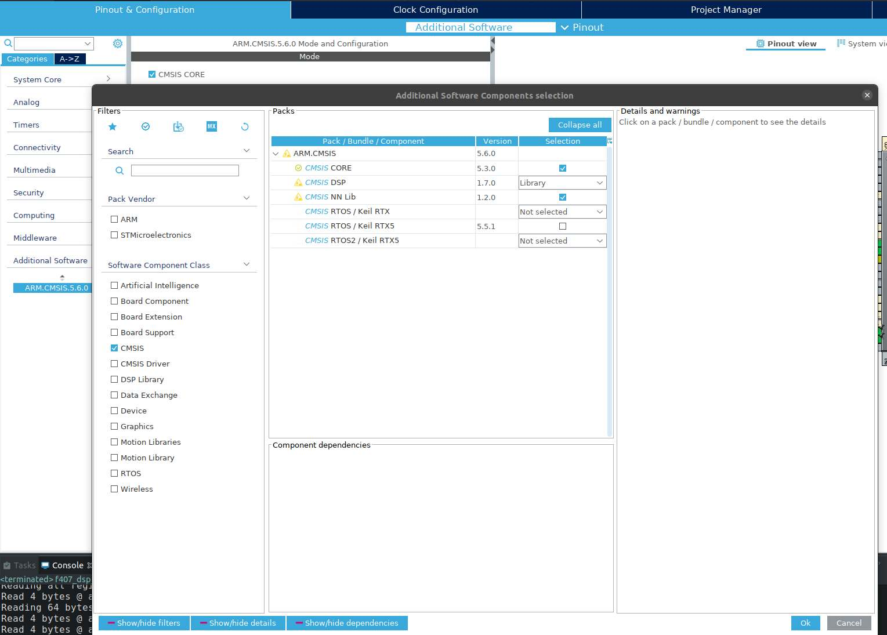
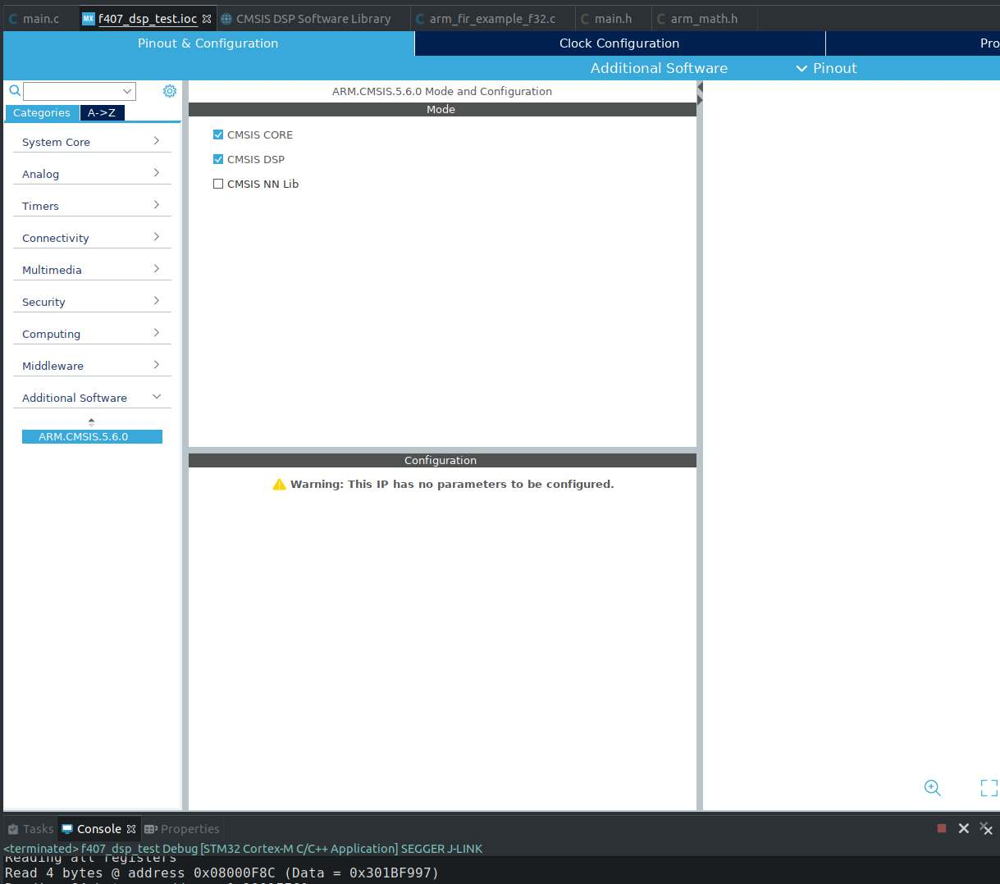
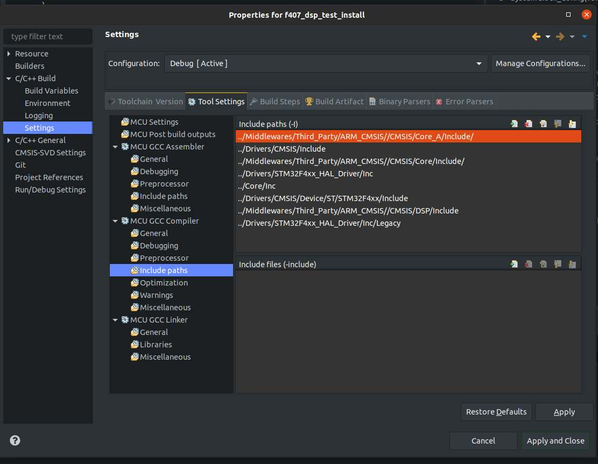
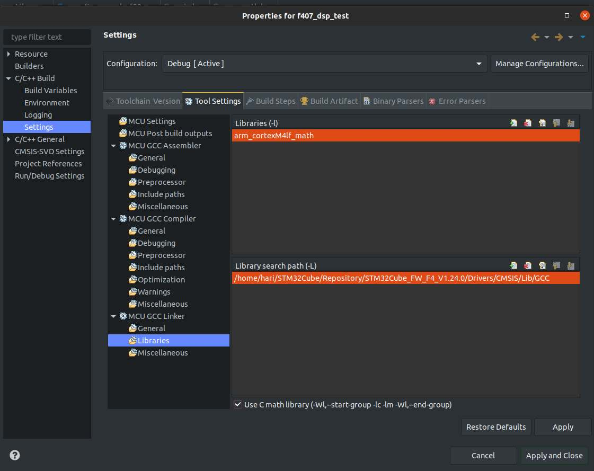

# Using CMSIS DSP libaries in STM32CubeIDE v1.2.0
Follow these steps to initialize an STM32CubeIDE project with CMSIS DSP library header files and library links.

## 1. (One-time) Install CMSIS DSP package

* Open the CubeMX .ioc file
* Go to the Additional Software tab
* Select CMSIS in the Software Component Class
* In the Packs window select `CMSIS CORE` and `CMSIS DSP (Library)` for installation

## 2. Activate CMSIS DSP for your project

## 3. Add CMSIS DSP header files to compiler include path

## 4. Specify Linker path and name for CMSIS DSP library

