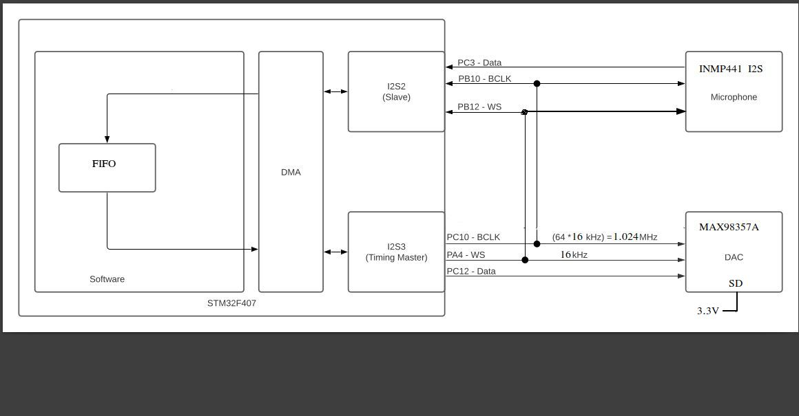

## I2S Microphone to I2S class-D Amplifier

Demonstrates use of I2S microphone as input and I2S class-D amplifier as output. This is adapted from
 [YetAnotherElectronicsChannel's project](https://github.com/YetAnotherElectronicsChannel/STM32_PDM_Microphone).
It uses the same framework, but is simpler as no PDM to PCM conversion is required.

I am using an INMP441 I2S microphone, and MAX98357A I2S Class-D amplifier. 

The INMP441 microphone generates 24bit data in a 32bit frame, and is configured for L channel. When the word select clock WS = 0, the 24 bit data is sent MSb first, 
left-aligned to the WS clock edge (with 1 BCK shift). The last 8 bits in the frame are 0. When WS = 1, 32 zero bits are sent for the R channel.

I2S3 is configured as Master half-duplex transmitter. It generates BCK and WS clocks for the microphone and  MAX98357 (DAC+power amplifier). The MAX98357A does not require an MCLK input. By default, if using 5V as a power supply, the module is set up to average the L and R channels if you leave the SD pin floating. I connected the SD input to 3.3V to configure the MAX98357A to use the L channel as input to the amplifier.

I2S2 is configured as half-duplex receiver and timing Slave. It receives BCK and WS from I2S3. So we have
to first enable the I2S3 transmitter generating BCK and WS, before enabling the I2S2 receiver.

The I2S DMA stream consists of 16bit (half-word) items. A 256 x 16bit FIFO is used between the input DMA stream and the output DMA stream due to the time difference in startup of I2S2 and I2S3.

