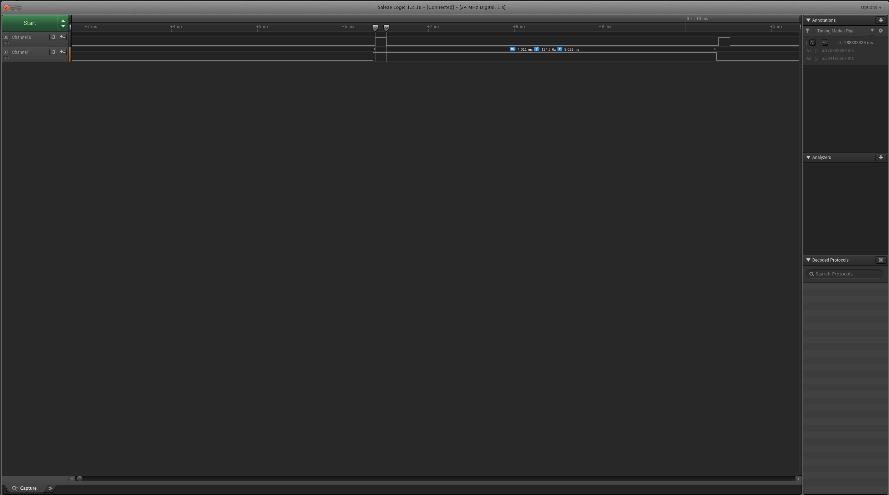
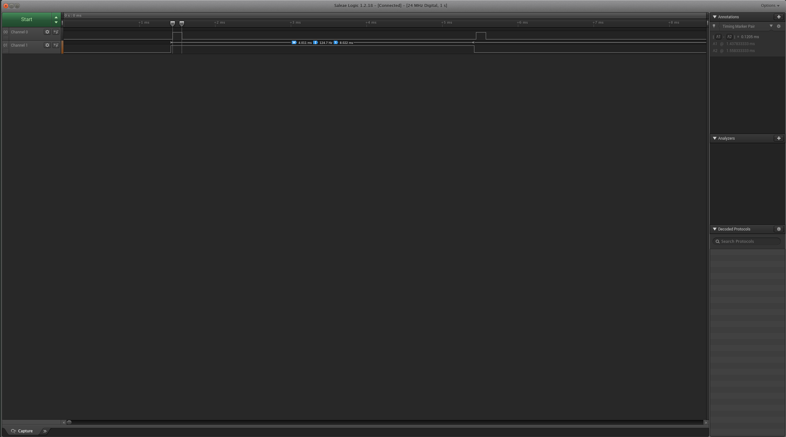
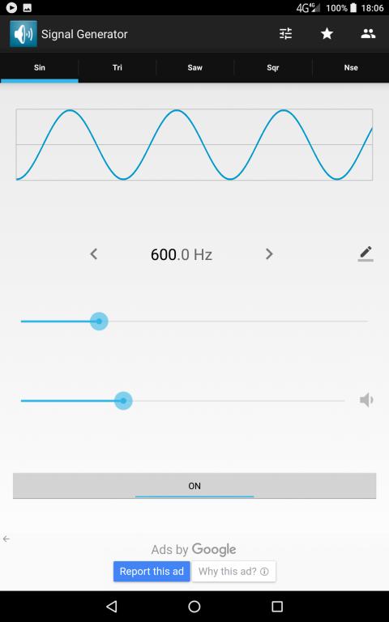
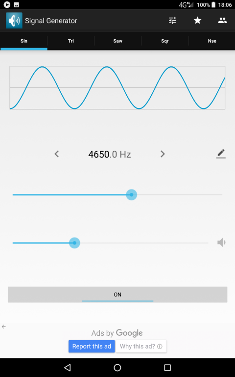
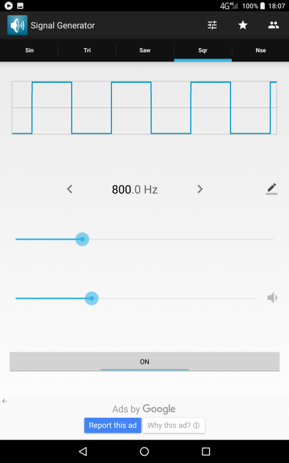
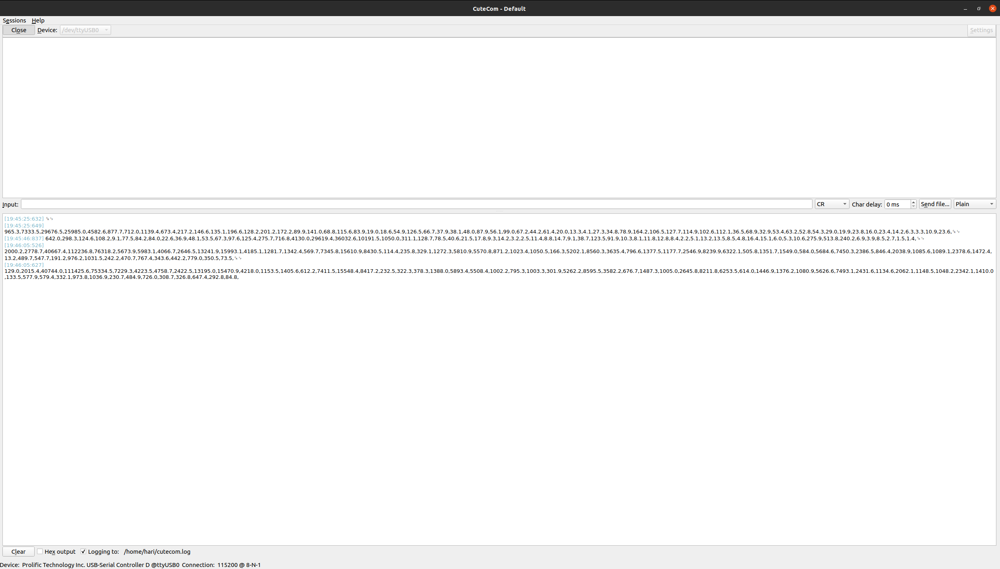
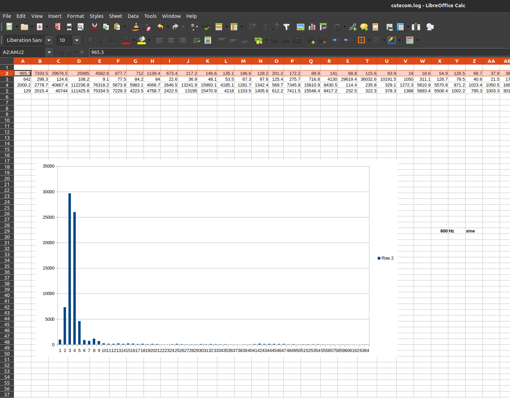
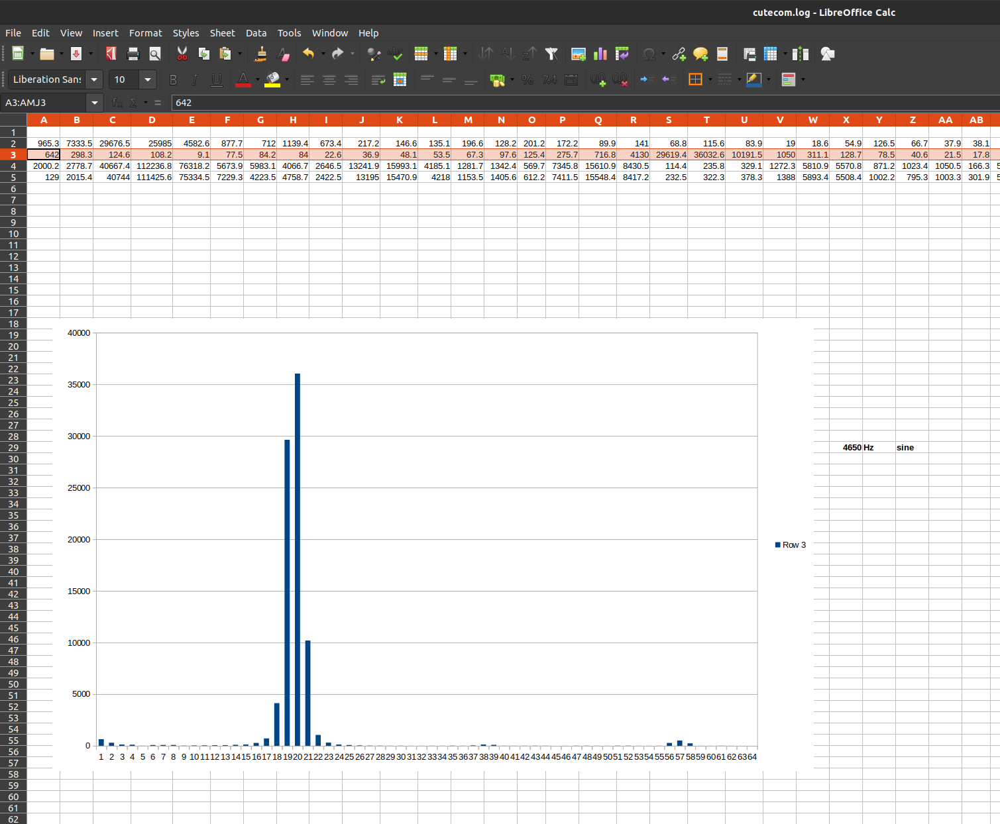

# Spectral analysis of audio stream from INMP441 I2S microphone

* I2S2 configured as I2S master half-duplex receive, 24bit data in 32bit frame,
Fs = 32kHz
* Only upper 16bits of sample data used
* circular DMA transfer to 128 point sample buffer
* Hanning window applied to input buffer before FFT
* ARM CMSIS DSP library fft calls

## Credits
[Monkey Listen project](https://github.com/ehughes/MonkeyListen)

## Fixed point versus floating point FFT

Implemented both ARM CMSIS fixed point Q15 and floating point F32 ffts.

On-board pin PA4 pulsed high for the FFT execution duration, pin PA5 toggled every time
we read 128 data samples from the I2S DMA receive buffer. Execution time was logged on a logic analyzer.

Q15 fft = 128uS
F32 fft = 120uS

On the STM32F407, it looks like there is no advantage to using fixed point for 128point FFTs. 

### Profiling execution time for fixed point Q15 FFT

### Profiling execution time for floating point F32 FFT

## FFT of test audio data from an external audio signal generator

* Android signal generator app used to generate 600Hz sine wave, 4650Hz sine wave and 
800Hz square wave tones on a phone placed next to microphone.
* Onboard PA0 button press used to trigger dump of FFT magnitude array to serial terminal.
* Serial terminal data log opened in spreadsheet for plotting.
* 128 point FFT with sampling frequency Fs = 32kHz.  Spectral resolution (array spacing) is 32kHz/128 = 250Hz.
     

