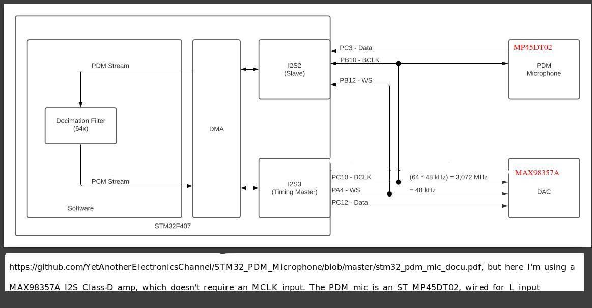
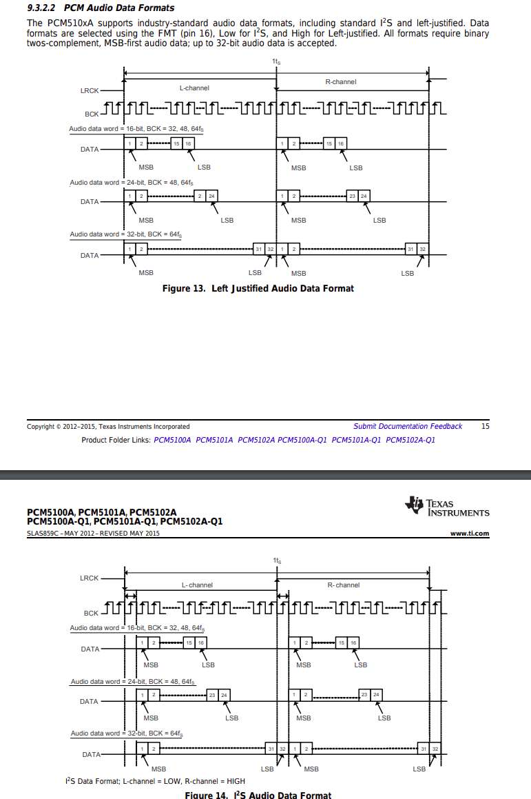

## PDM Microphone to I2S class-D Amplifier

Demonstrates use of PDM microphone as input and I2S class-D amplifier as output. This is a clone of 
the [YetAnotherElectronicsChannel project](https://github.com/YetAnotherElectronicsChannel/STM32_PDM_Microphone).
The only changes are the components used. I am using an STM MP45DT02 PDM microphone, and MAX98357A I2S Class-D amplifier. The MAX98357A does not require an MCLK input.

I2S2 is configured as a slave for timing, it receives BCLK from I2S3. The PDM2PCM library is used to convert the PDM data stream into PCM data.

See [this Youtube video](https://www.youtube.com/watch?v=JuXKeyFraF4) for an explanation of the data flow, STM32CubeIDE project setup and code review.

