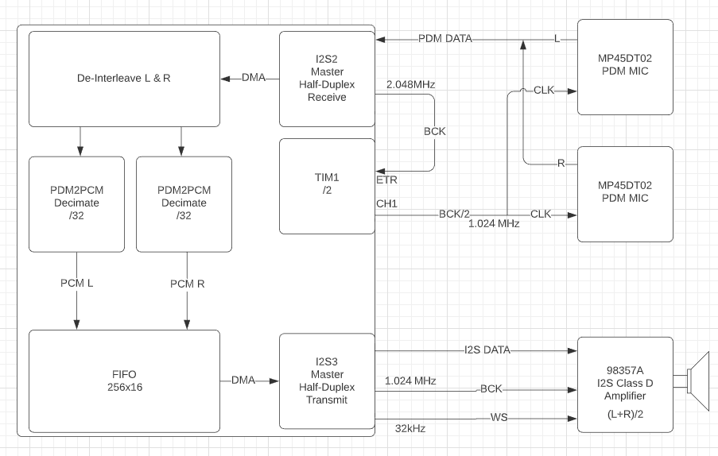

## Stereo PDM microphones to I2S Class D amplifier

This project demonstrates reception of PDM 1-bit data streams from two PDM microphones
configured for L and R channels respectively. I2S2 peripheral is configured to generate 
a BCK clock of 2.048MHz. TIM1 is used to divide the clock by 2, the two PDM microphones
transmit L and R data on the rising and falling edges of the 1.024MHz clock. They are tristated
when not transmitting data, so the two data lines can be connected together. 

I2S2 receives the LR bit interleaved stream. Separate PDM2PCM filters are used to decimate by
32 to L and R 32kHZ 16bit PCM streams which are then recombined and transmitted by I2S3 in
16-in-16frame data format to an I2S class D amplifier configured for (L+R)/2 mode.

### Credits

General data flow (mono PDM) and syncing FIFO concept from [this **YetAnotherElectronicsChannel** project](https://github.com/YetAnotherElectronicsChannel/STM32_PDM_Microphone). You should watch [his
Youtube video](https://www.youtube.com/watch?v=JuXKeyFraF4) for an explanation of PDM to PCM filtering.

## Data flow 

