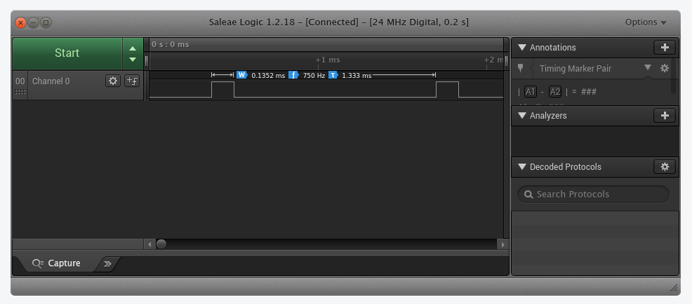

# Direct Digital Synthesis of periodic waveform 
* Outputs I2S digital stereo audio stream with 24bit resolution @ sampling frequency Fs = 48KHz
* In this example, the periodic waveform is a sine wave  with a harmonic
* Configurable inputs are 
	* L channel fundamental frequency = `L_WAVE_FREQ_HZ`
	* R channel fundamental frequency = `R_WAVE_FREQ_HZ`
	* Amplitude = `VOLUME`
* This project example demonstrates the resolution capability of direct digital synthesis.
* The L channel generates a 440.0Hz (musical A note) with harmonic at 880Hz. The R channel
generates a 440.5fHz with harmonic at 881Hz. 
* When played back through stereo speakers, or if you sum the channels before playback on a 
 mono speaker(MAX98357 I2S DAC default configuration), you will hear a beat note at 0.5Hz. 
* I2S peripheral configured in half-duplex master transmit mode
* Circular DMA transmit from sample buffer to I2S peripheral with half-complete and full-complete
  callbacks for the DDS code to generate new samples
* Implemented on WeAct STM32F411CEU6 Black Pill dev board. Will also  work with trivial mods on 
  the cheaper STM32F401CCU6 Black Pill board.
* In this example it takes 1.333mS to transmit a buffer of 64 stereo samples at 48kHz, while the 
DDS generation of 64 new samples only takes 0.135mS using integer arithmetic.

  
### Credits
* https://www.youtube.com/watch?v=YDC5zaEZGhM
* https://github.com/dimtass/stm32f407_dds_dac,
* https://github.com/YetAnotherElectronicsChannel/STM32_PDM_Microphone
