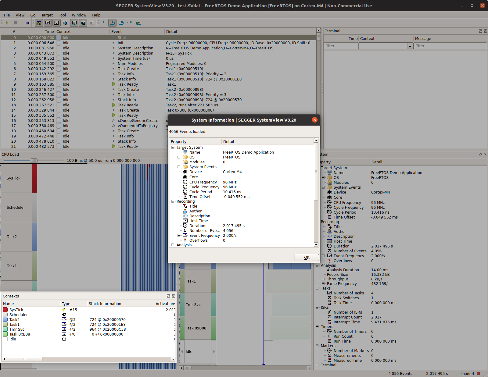

# Integrating SystemView into FreeRTOS project in STM32CubeIDE

## Environment

* STM32CubeIDE version v1.6.0
* MCU Firmware version FW_F4 V1.26.0
* FreeRTOSv202012.00 downloaded from FreeRTOS.org
* SystemView Linux 64-bit portable package and SystemView Target Sources v3.20
* WeAct STM32F411CEU6 "Black Pill" development board
* Reference project : `freertos_f411_hello_world_sysview`

* Download Systemview from segger.com
	* SystemView Linux 64-bit portable package (v3.20). Extract the archive and make the application executable.
```
	chmod 755 ./SystemView
	./SystemView
```
	The application will start up in demo mode. You can load one of the sample svdat files from the archive
	to examine.
	* SystemView Target Souces (v3.20). Extract the zip file. The following files will be pulled into
	your STM32CubeIDE project tree
```
    /Config
        Global.h
        SEGGER_RTT_Conf.h
        SEGGER_SYSVIEW_Conf.h
    /Sample
        /FreeRTOSV10
            /Config
                /Cortex-M
                    SEGGER_SYSVIEW_Config_FreeRTOS.c
            SEGGER_SYSVIEW_FreeRTOS.c
            SEGGER_SYSVIEW_FreeRTOS.h        
    /SEGGER
        Everything except for /Syscalls unrelated compiler files
```
* The following steps assume you have a working STM32CubeIDE FreeRTOS project. In this case I copied 
 `freertos_f411_hello_world` to a temp workspace, imported it and used STM32CubeIDE to rename it to 
 `freertos_f411_hello_world_sysview`. 
* Create the following project folder structure under `freertos_f411_hello_world_sysview/ThirdParty`:
```
/SEGGER
	/Config
	/OS
	/Patch
	/SEGGER 
```
* Make sure none of the subfolders are excluded from project build
* Populate the project SystemView subfolders from the source archive as follows :
	* Copy the patch file `FreeRTOSv202012.00_segger_cm4_v1.path` from the reference project `freertos_f411_hello_world_sysview/ThirdParty/SEGGER/Patch` to your project `/ThirdParty/SEGGER/Patch` folder
	* In the `/SEGGER/SEGGER` subfolder copy everything from the source archive
	* In the `/SEGGER/SEGGER/Syscalls` subfolder, delete all compiler-specfific .c files except for
	 `SEGGER_RTT_Syscalls_GCC.c`
	* Your `SEGGER` folder tree should look like this
```
/SEGGER
    /Config
        Global.h
        SEGGER_RTT_Conf.h
        SEGGER_SYSVIEW_Conf.h   
        SEGGER_SYSVIEW_Config_FreeRTOS.c        
    /OS
        SEGGER_SYSVIEW_FreeRTOS.c
        SEGGER_SYSVIEW_FreeRTOS.h        
    /Patch
        FreeRTOSv202012.00_segger_cm4_v1.patch
    /SEGGER
    	/Syscalls
    		/SEGGER_RTT_Syscalls_GCC.c (delete the other compiler related *.c files)
        ...
```
* Patching 
    * Right click on project `/ThirdParty`, select Team->Apply Patch->select patch file
    * Browse for `FreeRTOSv202012.00_segger_cm4_v1.patch` and click on `Next` to patch
* Edit `FreeRTOSConfig.h`
   * Add two #defines to list after `#define INCLUDE_vTaskDelay 1`
```
    #define INCLUDE_xTaskGetIdleTaskHandle 1
    #define INCLUDE_pxTaskGetStackStart     1
```
    Add `#include "SEGGER_SYSVIEW_FreeRTOS.h"` at end of file
* Edit `/SEGGER/SEGGER/SEGGER_SYSVIEW_ConfDefaults.h` to define the CPU architecture,
and modify the trace buffer size. The STM32F411CEU6 has 128kBytes of RAM, we are using
16kBytes of RAM for the buffer. If you have RAM constraints in your application, reduce this.
```
  #ifndef   SEGGER_SYSVIEW_CORE
    #define SEGGER_SYSVIEW_CORE SEGGER_SYSVIEW_CORE_CM3
  #endif

 ...
   
#ifndef   SEGGER_SYSVIEW_RTT_BUFFER_SIZE
  #define SEGGER_SYSVIEW_RTT_BUFFER_SIZE          (1024*16)
#endif
  
```
* Edit `SEGGER_SYSVIEW_Config_FreeRTOS.c`. App name can be anything you like.
```
    #define SYSVIEW_APP_NAME    "FreeRTOS_F411_SysView_Demo"
    #define SYSVIEW_DEVICE_NAME  "STM32F411CEU" 
    
	#define SYSVIEW_RAM_BASE        (0x20000000)    
```
* Add STM32CubeIDE include paths in Settings->Tool Settings->GCC Compiler
```
        /ThirdParty/SEGGER/Config
        /ThirdParty/SEGGER/OS
        /ThirdParty/SEGGER/SEGGER
```
* Add STM32CubeIDE include path for GCC Assembler
```
        /ThirdParty/SEGGER/Config
```
* Add this line of code in `main.c`
before calling any FreeRTOS api functions. DWT CycleCounter is enabled so that trace event timestamps can be recorded. 
```
  /* USER CODE BEGIN 2 */
  DWT->CTRL |= (1 << 0); // enable CYCCNT for SystemView
```
* Add SystemView config and start statements in `main.c` just after the DWT counter is enabled and
 before any FreeRTOS api calls. 
``` 
	SEGGER_SYSVIEW_Conf();
  	SEGGER_SYSVIEW_Start();
```
* To avoid `configAssert` error in `SEGGER_SYSVIEW_Start()` caused by 
 un-initialized variable `ulMaxPRIGROUP`, call  `vInitPrioGroupValue()` at the
 end of `HAL_MspInit()` in `stm32f4xx_hal_msp.c`. Add `#include "FreeRTOS.h"` at the top of the file.
* Build and run in debug mode. The debugger will stop at the breakpoint at beginning of main().
* For one-shot recording, click on Run and then Pause after
a couple of seconds, to allow the RTT trace buffer to fill.  
* Select STM32CubeIDE toolbar->Window->Perspective->Debug if not already in debug perspective
* Select STM32CubeIDE toolbar->Window->Show View->Expressions
	* Add new expression, enter `_SEGGER_RTT` and enter
	* Get the values of `aUp[0]->pBuffer` (address) and `aUp[0]->WrOff` (offset). The value of WrOff 
	should be 1 less than the trace buffer size you specified in `SEGGER_SYSVIEW_ConfDefaults.h`
* Select  STM32CubeIDE toolbar->Window->Show View->Memory Browser
	* Enter the `aUp[0]->pBuffer` address in the Memory Browser (e.g. 0x200132b0 ) and click on `Go`. 
	The window should fill up with trace buffer records
	* Click on the export icon on the right just above the address entry and set `Length` to the value of 
	`WrOff` you just found in the Expressions window. 
	* Specify `Raw Binary` as data format and export the file as `anyname.SVdat`.
	
* Start up SystemView and load the .SVdat trace file to analyze the records.


	
* To trace software timer entry and exit, add this to `SEGGER/OS/SEGGER_SYSVIEW_FreeRTOS.h` and add the
directory `SEGGER/OS` to the C/C++ build settings include paths. See the freertos_f411_queue project example.
```
#define traceTIMER_ENTER(pxTimer)	SEGGER_SYSVIEW_RecordEnterTimer((U32)pxTimer)
#define traceTIMER_EXIT()		SEGGER_SYSVIEW_RecordExitTimer()
 ```
 

