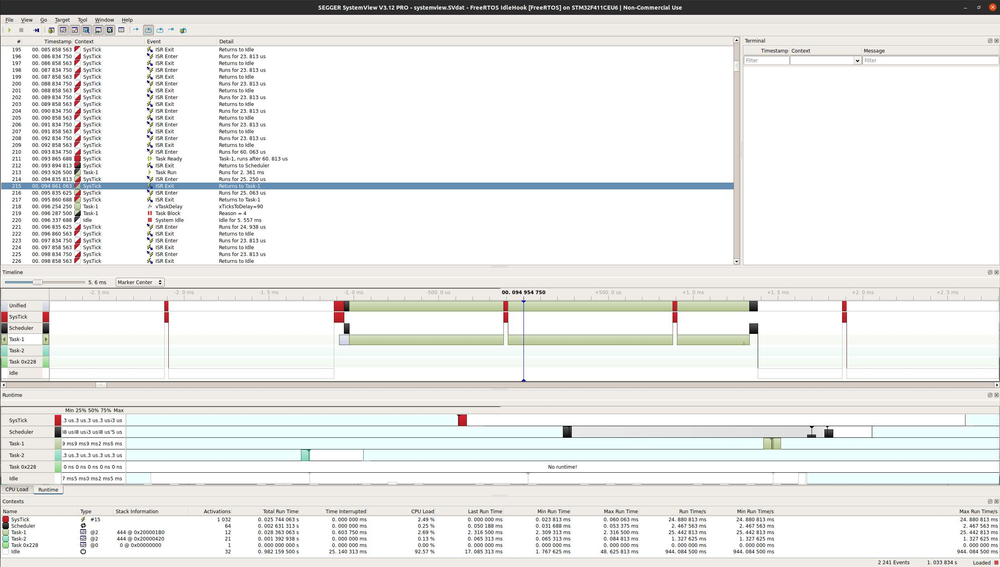
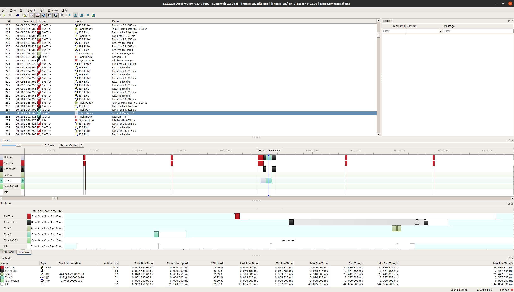

## SystemView trace

You can use Segger SystemView to load the `systemview.SVdat` file in this directory and trace
the logged events from task start up. A couple of screenshots of task details from this log
are shown here.

Note these are logged with the idlehook __WFI() call commented out.

## SystemView detail of Task 1

## SystemView detail of Task 2

