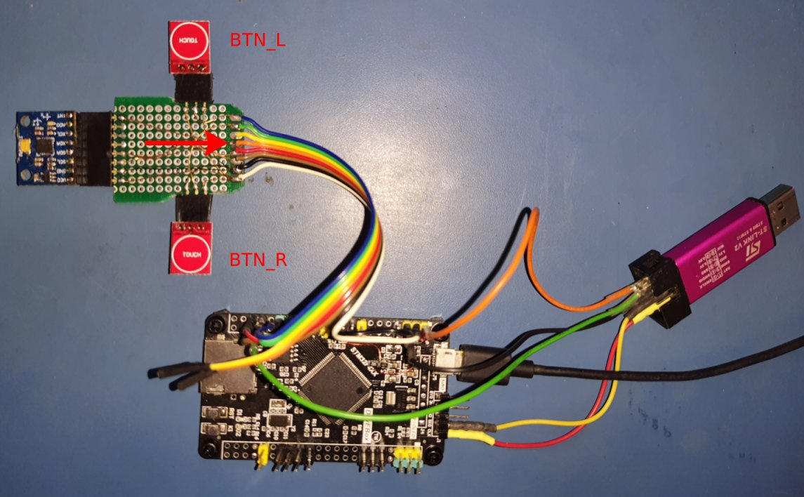
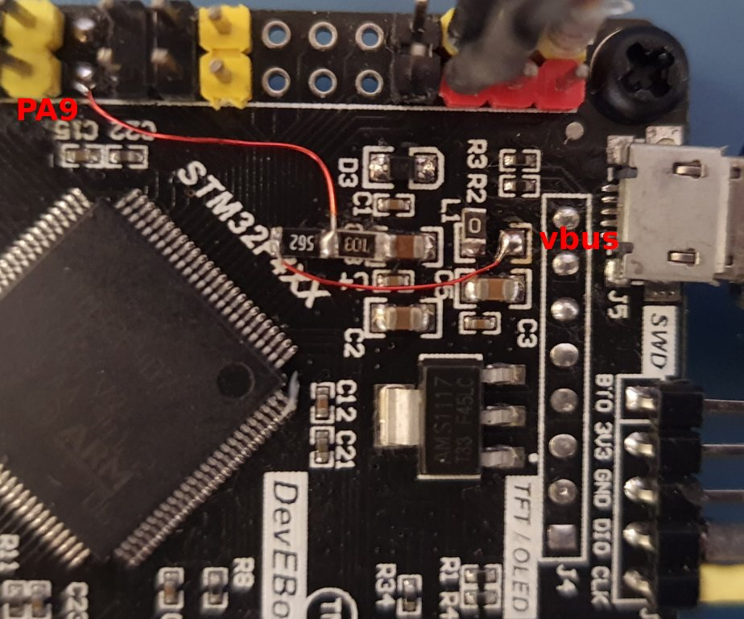

# USB FS HID Mouse

USB full-speed HID mouse implemented with STM32F407VGT6 development board using MPU6050 accelerometer for pointer movement (roll left and right for x movement, pitch up and down for y movement) and two TTP223 capacitive buttons for left and right mouse buttons.

## Credits

* Udemy [USB-Behind the scenes](https://www.udemy.com/course/usb-behind-the-scenes-hands-on-hid-firmware-development/) code archive. This code was developed for an STM32F429 Discovery board using the HS interface with internal FS PHY. 

## Development Environment

### Software

* Ubuntu 20.04 AMDx64
* STM32CubeIDE v1.6.0
* CubeMX MCU Firmware version FW_F4 V1.26.1
* Wireshark

### Hardware

* DevEBox STM32F407VGT6 development board 
* STLink v2 clone with [mod for SWO trace](http://eeblog.co.uk/2018/11/29/swo-with-cubemx-using-st-link-clones/)
* GY-521 MPU6050 6-axis accelerometer+gyroscope
* TTP223 capacitive switches

  
## Project Notes

* USB full-speed HID mouse uses the on-board micro-usb connector connected to the FS PHY (PA11 & PA12)
* Left and right mouse buttons using capacitive TTP223 switches
* Mouse pointer movement using MPU6050 accelerometer roll left and right, pitch up and down
* Configured as self-powered with VBUS sensing using PA9. Normally the 5V supply from micro-usb connector VBUS is connected to the circuit via the fuse L1 (actually a 0ohm resistor on the dev board).  L1 is disconnected and a resistor divider with 5K6 and 10K resistors to ground is used to get a sensed voltage ~3.3V which is connected to PA9. 
* The board 5V pin is connected to the STLink adapter 5V supply
* The TTP223 capacitive switch breakout boards are in default configuration - logic high when pressed, logic low otherwise.
* No HAL or LL libraries - only CMSIS headers used
* Debug print logging via SWO trace (pin PB3) 
    

