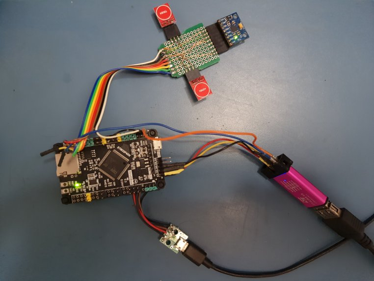

# USB HID Mouse using OTG_HS peripheral

USB HID mouse implemented with STM32F407VGT6 development board using the USB_OTG_HS peripheral. An MPU6050 accelerometer is used for pointer movement and two TTP223 capacitive buttons are used for left and right mouse buttons. 

## Credits

* Udemy [USB-Behind the scenes](https://www.udemy.com/course/usb-behind-the-scenes-hands-on-hid-firmware-development/) code archive, developed for an STM32F429 Discovery board using the USB_OTG_HS interface (PB14, PB15) with internal FS PHY and PB13 for VBUS sensing. Highly recommended to take this course so you can understand the development progression from driver to framework to hid application.

## Development Environment

### Software

* Ubuntu 20.04 AMDx64
* STM32CubeIDE v1.6.0
* CubeMX MCU Firmware version FW_F4 V1.26.1
* Wireshark

### Hardware

* DevEBox STM32F407VGT6 development board 
* STLink v2 clone with [mod for SWO trace](http://eeblog.co.uk/2018/11/29/swo-with-cubemx-using-st-link-clones/)
* GY-521 MPU6050 6-axis accelerometer+gyroscope
* TTP223 capacitive switches

  
## Project Notes

* The WeAct STM32F407VGT6 board has an on-board micro-usb connector connected to the USB_OTG_FS peripheral interface (pins PA11, PA12). However, this project demonstrates the use of the USB_OTG_HS peripheral using internal FS PHY.
* An external micro-usb breakout board is connected to the USB_OTG_HS interface (PA14, PA15) pins with PA13 for VBUS sensing.
* USB device configured as self-powered with VBUS sensing using PA13. A 5K6 resistor and 10K resistor in series are connected from the micro-usb breakout board VBUS to ground, and PA13 is connected to the resistor junction to get a ~3.3V VBUS sense voltage.
* The STLink adapter connector 5V pin supplies power for the board and is connected to one of the dev board 5V pins.
* Left and right mouse buttons uses capacitive TTP223 switch modules connected to GPIO pins PD4 and PD5. The switch modules are powered by the board 3V3 supply and are in default configuration : logic high when pressed, logic low otherwise.
* Mouse pointer x and y movement uses MPU6050 accelerometer readings : roll left and right, pitch up and down.
* MPU6050 module is powered by the board 3V3 supply and uses I2C1 interface pins PB6 (SCL) and PB7 (SDA). The accelerometer readings are polled at the USB HID configured interval of 50 frames = 50mS.
* Debug printf logging via SWO trace (pin PB3).
* The software does not use HAL or LL libraries - only CMSIS headers.
    

