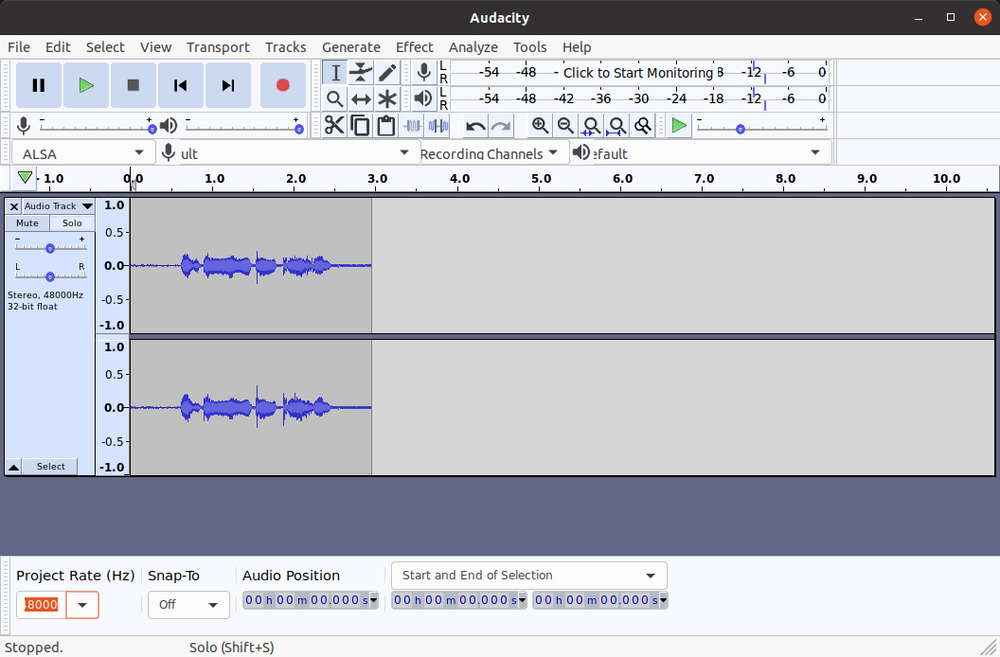

# USB FS stereo I2S microphone

USB full-speed microphone (sampling rate 48kHz, stereo 16-bit resolution) implemented with WeAct STM32F411CEU6 "Black Pill" development board and two INMP411 I2S microphones. 
This is configured as bus-powered, with no VBUS sensing i.e. the device assumes it is connected to a USB host if powered on. 

## Credits

* [Andy Brown's USB microphone](https://andybrown.me.uk/2021/03/13/usb-microphone/). I have 
  * refactored the code as a C project
  * extended it from mono to stereo 48kHz 16-bit microphone recording
  * used the internal I2S PLL to generate the clocks
  * removed the software volume control and equalizer libraries which require 10mS audio buffers to work with - I am using 1mS buffers.
  * optimized the txfifo buffer size for recording

## Development Environment

### Software

* Ubuntu 20.04 AMDx64
* STM32CubeIDE v1.6.0
* CubeMX MCU Firmware version FW_F4 V1.26.1

### Hardware

* WeAct "Black Pill" STM32F411CEU6 development board 
* STLink v2 clone with [mod for SWO trace](http://eeblog.co.uk/2018/11/29/swo-with-cubemx-using-st-link-clones/)
* INMP441 24-bit I2S MEMS microphone modules (breakout boards)

  
## Project Notes

* USB full-speed HID mouse uses the on-board micro-usb interface connected to the USB_OTG_FS peripheral pins PA11, PA12.
* USB device configured as bus-powered without VBUS sensing
* The I2S1 peripheral is configured as 
  * half-duplex master receive
  * internal PLL generates the BCK and WS clocks to the microphones
  * 24/32 I2S Philips standard
  * the internal I2S PLL clock generates an actual Fs = 47.048kHz when configured for Fs = 48kHz
* In bsp_mic.c, a level boost of +12dB is applied to the incoming microphone data. Multiplying the 2's complement pcm data by a factor of 2 is equivalent to a +6dB boost (20*log10(2))
* I used Audacity on my Ubuntu PC to record and playback the stereo audio. Example below is for a voice recording "Testing 1, 2, 3, 4".

